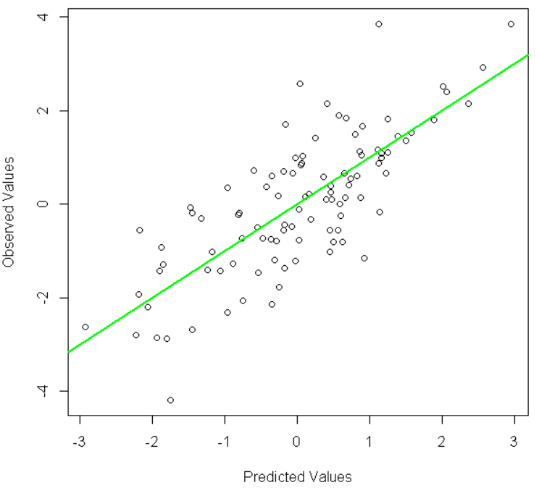

**Задание 2**

- Используйте написанный вручную алгоритм линейной регрессии и получите регрессионную линию, которая описывает вес человека (целевой признак **Y**) на основе его роста (один исходный признак **X**). Датасет с обучающими данными – [https://www.kaggle.com/datasets/yersever/500-person-gender-height-weight-bodymassindex](https://www.kaggle.com/datasets/yersever/500-person-gender-height-weight-bodymassindex). Визуализируйте все этапы решения (исходные точки, регрессионную прямую, спадание функции ошибки).
- Используйте написанный вручную алгоритм множественной линейной регрессии и получите регрессионную модель (коэффициенты регрессии), которая описывает стоимость домов (целевой признак **Y**) на основе их характеристик (несколько исходных признаков **X**). Датасет с обучающими данными [https://www.kaggle.com/datasets/denkuznetz/housing-prices-regression](https://www.kaggle.com/datasets/denkuznetz/housing-prices-regression). Визуализируйте спадание функции ошибки для 3 различных (укажите сами) параметров learning rate.
- Реализуйте обучением модели линейной регрессии для 2 прошлых задания с использованием готового класса LinearRegression из библиотеки Scikit-Learn.
- В предыдущих 2 заданиях все объекты из датасета были использованы в качестве обучающих данных. Для каждого из датасетов выполните следующие шаги. Отложите по 30 обучающих примеров. Обучите модель на оставшихся данных. Для 30 отложенных объектов выполните прогноз целевой переменной. Сравните прогнозы модели с правильными ответами. Визуализируйте сравнение по следующему примеру:

