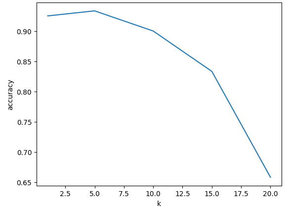
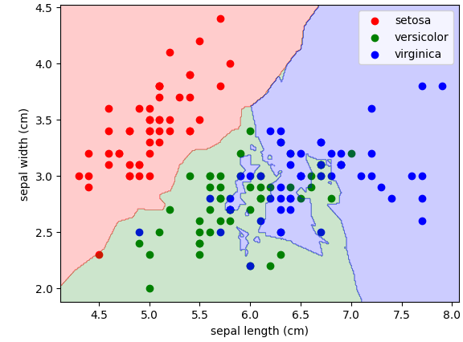

**Задание 3**

Загрузите из библиотеки sklearn набор данных «load iris»
Напишите собственную реализацию метода k-ближайших соседей, которая имеет гиперпараметры:

- Метрика расчета расстояния
- k (число ближайших соседей)

Повторите последовательность шагов задачи классификации, приведенную в материалах занятия 3

Загрузите из библиотеки sklearn набор данных «breast cancer»

Используйте готовую модель классификации методом k-ближайших соседей из библиотеки sklearn (**KNeighborsClassifier**) и спрогнозируйте класс опухоли (**Y**) на основе 30 признаков (**X**) для датасета «breast cancer». Постройте график зависимости точности модели от значения гиперпараметра **k**. **k** варьируйте в пределах \[1-30\]. Например

Постройте 2D карту показывающий границу классификации для какого-либо значения **k.** Чтобы построить 2D карту пространства признаков вам нужно обучить модель на 2 каких-либо признаках. Пример:

Загрузите из яндекс диска набор данных «house» на задачу регрессии. Используйте готовую модель регрессии методом k-ближайших соседей из библиотеки sklearn (**KNeighborsRegressor**) и спрогнозируйте цену дома price (**Y**) на основе остальных признаков (**X**). В качестве метрики точности используйте функцию **mean absolute error (MAE)**. Постройте график зависимости точности модели от значения гиперпараметра **k**. **k** варьируйте в пределах \[1-30\]
