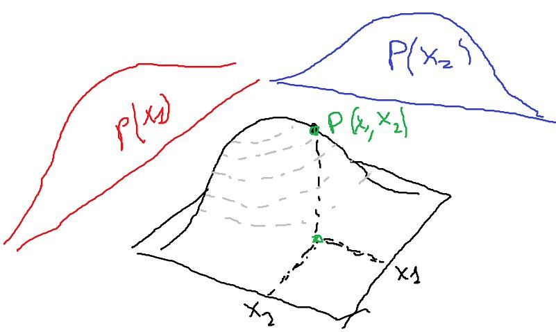
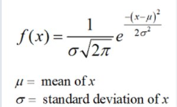

**Задание 6**

*(текст извлечён из `06 задание.pdf` — рисунки лежали внутри PDF как tiling patterns, поэтому в media/ они добавлены отдельно)*

Реализовать собственный алгоритм Наивной Байесовской классификации и применить ее
для задачи классификации на датасете «breast cancer».

Теор. основу метода смотрите в материалах к занятию 6.

Достаточно рассмотреть только 2 первых признака т.к. этот подход довольно
вычислительно сложный.

При расчете условной вероятности P(X|A) – то есть вероятности, что у объекта будут
признаки X, если он точно относится к классу A использовать 2 подхода:

**1 подход.** Численно перемножать распределения признаков для нахождения P(X|A),
например P([x1, x2] | A) = P(x1|A) * P(x2 | A). Перемножение двух векторов
распределений вам даст двумерную матрицу распределений (см. рис.). Используйте
функции для работы векторами и матрицами из NumPy

**2 подход.** Аналитически получить двумерную функцию распределения P([x1, x2] | A),
используя перемножения двух одномерных распределений P(x1|A) * P(x2 | A)
представленных (аппроксимированных) в виде гауссовских функций:

