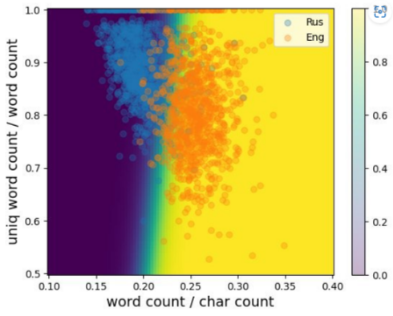

**Задание 8**

Создать и обучить модель логистической регресии, которая будет определять язык текста по следующим 2 признакам:

1. Отношение количества слов в тексте к количеству букв в тексте.
2. Отношение количества уникальных слов в тексте к общему количеству слов.

Для обучения модели можно использовать любые тексты, удобно использовать тексты книг. Тексты необходимо загрузить в формате srting, очистить от знаков препинания, выделить отдельные слова. Далее, тексты нужно разбить на фрагменты разной длины. Размер фрагментов текста от 10 до 100 слов. Эти фрагменты и будут выступать в качестве обучающих примеров. Каждому фрагменту у вас будут соответствовать два вышеуказанных признака.

В результате у вас получится модель, которая может принять фрагмент текста и выдать вероятность его отношения к русскому или английскому языку.

Визуализируйте признаковое пространство и для каждой точки пространства цветом обозначьте вероятность его принадлежности к тому или иному классу. Для примера – вот такой график при использовании текста книги «Отцы и дети» Тургенева для русского языка и «Гроздья гнева» Стейнбека для английского. Для других книг распределение может немного отличаться. Здесь точки — текстовые фрагменты, сплошными цветами показаны предсказания обученной модели.

