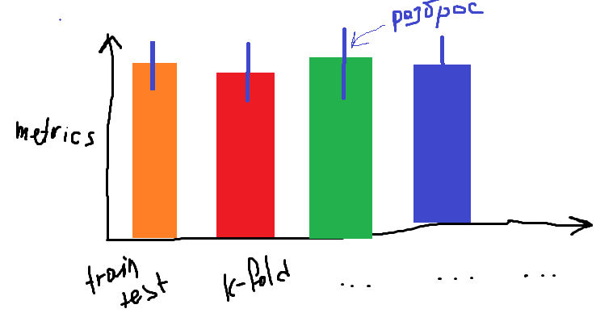
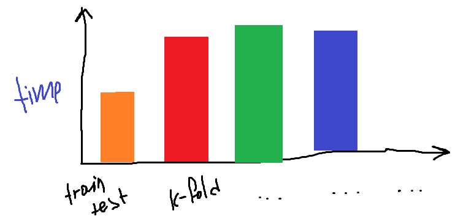

**Задание 11**

Внимание!!!! Для данного задания отберите датасет только из 500 примеров (по 50 примеров каждого  класса), иначе обучение будет очень долгим для Leave-one-out и Leave-p-out. Если обучение все еще долгое, используйте меньше слоев и нейронов

На прошлом задании 10 (часть 2) вы написали модель нейронной сети для классификации изображений цифр mnist. В задании 10 вы использовали простое разбиение train-test для оценки модели. В данном задании вам предстоит оценить вашу модель с помощью различных вариантов разбиений:

- Train-test-split with stratify
- K-fold split with stratify (параметр =10)
- Leave-one-out
- Leave-p-out (параметр p=20)

И различных метрик:

- Accuracy
- Recall
- Precision
- F1-score

Для каждого варианта разбиения рассчитайте средние значения и дисперсии полученных метрик (например, для K-fold split вы усредняете по k-ответам, для leave-one-out усредняете по N-ответам, где N-кол-во обучающих примеров). Постройте график такого типа:

Для каждого варианта разбиения рассчитайте общие временные затраты на обучение и тестирование модели. Постройте график такого типа:

