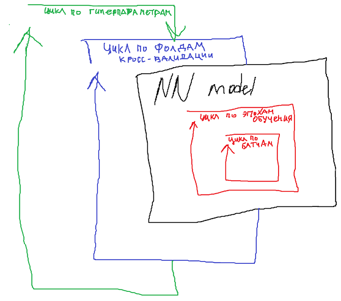

**Задание 12**

Ознакомиться с реализацией поиска оптимальных гиперпараметров модели через стратегии RandomSearch и GridSearch. В этих стратегиях надежным методом оценки модели является кросс-валидация (см. файл 12 занятие.pdf)

Далее в файле (12 занятие.pdf) приведен пример кода для реализации кросс-валидации модели нейронной сети для задачи регрессии, похожий код будет и для модели нейронной сети для классификиации, см. 10 занятие). Вам необходимо добавить к этой модели возможность поиска гиперпараметров с помощью стратегии RandomSearch или GridSearch (выберите что-то одно). Таким образом вам необходимо обернуть вашу модель в еще один цикл, в котором будут перебираться гиперпараметры.

В качестве модели используйте нейронную сеть для классификации изображений цифр mnist (из заданий 10-11). Если модель долго обучается на вашем устройстве, используйте не полный датасет (60.000 samples), а его часть. Также можно взять меньшее разбиение на фолды кросс-валидации (3 or 5).

Варьируемые гиперпараметры для RandomSearch или GridSearch:

- n\_layers = варианты укажите сами
- n\_neurons = варианты укажите сами
- batch\_size = варианты укажите сами
- optimizer = SGD, Adam, RMSprop, Adagrad

В результате поиска гиперпараметров вы должны получить такую табличку

| № search | n\_layers | n\_neurons | batch\_size | optimizer | ACCURACY | PRECISION | RECALL | F1-SCORE |
|---|---|---|---|---|---|---|---|---|
| 1 |  |  |  |  |  |  |  |  |
| 2 |  |  |  |  |  |  |  |  |
| 3 |  |  |  |  |  |  |  |  |
| ... |  |  |  |  |  |  |  |  |
