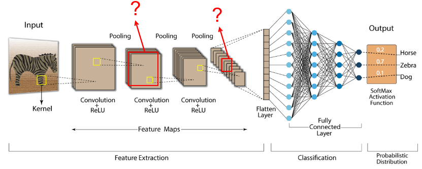

Задание 13

Ознакомиться с учебными материалами по теме сверточных нейронных сетей (Convolutional Neural Networks)

Написать модель сверточной нейронной сети для классификации изображений цифр (датасет mnist)

Рассмотреть архитектуры следующих видов:

Input – convolution layer– pooling layer– convolution layer – pooling layer - basic NN

Input – convolution layer– pooling layer– convolution layer – pooling layer – convolution layer – pooling layer - basic NN

Используйте следующие параметры для convolution layers: padding =1, stride = 1, kernel size = 3

Используйте следующие параметры для pooling layers: padding =0, stride = 2, kernel size = 2

Параметр n\_chanels для convolution layers назначьте сами или подберите методом GridSearch или RandomGridSearch

Тип pooling layers (Min or Max or Average) назначьте сами или подберите методом GridSearch или RandomGridSearch

Извлеките и визуализируйте из какого нибудь-промежуточного слоя нейронной сети карту признаков (преобразованное представление исходого изображения)

