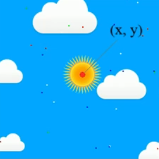

**Задание 14

*Предисловие***

На занятиях 13 и 14 мы разобрали как использовать сверточную нейронную сеть для решения задачи классификации изображений.

Использование сверточной нейронной сети для классификации изображений, в которых 1 канал (черно-белый) см. в материалах к занятию 13 на примере датасета MNIST

Использование сверточной нейронной сети для классификации изображений, в которых 3 канала (RGB) см. в материалах к занятию 14 на примере датасета CIFAR

В материалах к занятию 14 в разделе «Варианты загрузки датасетов» был приведен шаблон кода как готовить датасет с изображениями для задачи **классификации** и схема, согласно которой изображения должны располагаться в папках

***Задача***

В данном задании вам предстоит решить задачу регрессии (предсказания одной или нескольких целевых величин для изображения) с использованием сверточной нейронной сети.

Для начала перейдите в материалы к занятию 14 в разделе «Варианты загрузки датасетов», там приведен шаблон кода как готовить датасет с изображениями для задачи **регрессии** и схема, согласно которой изображения должны располагаться в папках

Изображения (входные данные **X**) будут представлять собой RGB (3 канала) картинки, на которых изображено солнце. Размер всех изображений 256 х 256

 (датасет выложен на яндекс диске под именем «14 задание датасет»)

Для каждой картинки целевыми переменными **Y** являются координаты солнца (*x, y*) на картинке. Координаты совпадают с пикселями изображения и варьируются от 0 до 255. Ваша нейронная сеть должна прогнозировать две величины (две координаты), соответственно она должна иметь 2 нейрона на выходе

Вам необходимо адаптировать изученные нами архитектуры сверточных нейронных сетей для решения задачи регрессии.

Во-первых (как я упомянул выше) нужно использовать способ загрузки данных именно для регрессии

Во-вторых, учтите, что в задаче регрессии используются другие функции потерь и алгоритмы расчета метрик (чтобы вспомнить как организуется нейронная сеть для задачи регрессии, повторите материалы к занятиям 9 и 10)
