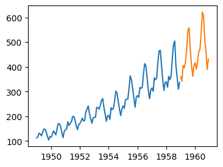
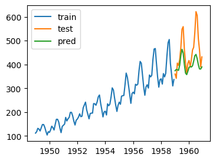
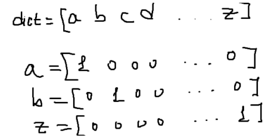

**Задание 15 и 16**

Внимательно ознакомиться с материалами к занятиям 15 и 16. Разобраться в том:
- как работают рекуррентные слои
- как готовить обучающий набор данных при работе с последовательностями

- как обучаются сети RNN
- как получать прогноз помощью обученной RNN сети (авторегрессия)

**Часть 1**

Прочитайте набор данных, содержащий ежедневные данные о родившихся в Калифорнии в 1959 году девочках (births.csv). Каждая запись имеет только 1 признак (n\_feature=1) - кол-во новорожденных. Отложите последние 20% записей из данного набора. Визуализируйте временной ряд, разными цветами покажите первые 80% записей и последние 20% записей.

Масштабируйте данные в диапазон \[0;1\]. На основе 80% записей сформируйте массивы с обучающими примерами X и Y для рекуррентной нейронной сети (см. материалы к теме 16). Создайте модель рекуррентной нейронной сети, которая содержит 1 рекуррентный слой и 1 линейный слой. Обучите данную сеть на первых 80% ваших данных. Сравните работу (метрики MAE, RMSE) модели при различных условиях:

- Различных количествах нейронов в рекуррентном слое **n\_neurons\_layer\_h**
- Количество записей **x\_len**, на основе которых делается прогноз следующих записей **y\_len** (используйте **y\_len = 1)**

Обученную нейронную сеть используйте чтобы получить прогноз для отложенной выборки. Для получения прогнозов используется принцип авторегрессии (см. материалы к теме 16).
Сравните прогноз с истинными значениями

**Часть 2**

В качестве набора данных в этом задании выступает текст. Последовательность букв – это тоже временной ряд: позиция буквы – номер записи, сама буква – это данные в этой записи.

Как представить каждую букву как объект с набором признаков? Сколько признаков будет у букв? Используем one-hot представление каждой буквы, например:

Тогда количество признаков в букве = длина словаря dict. Для простоты рассмотрим текст состоящий из строчных русских букв + пробел. Тогда длина словаря = 34.

Тексты для задания:

кот пил молоко и пес пил молоко кот пил молоко и пес пил молоко кот пил молоко и пес пил ...

сегодня был дождь и завтра будет дождь сегодня был дождь и завтра будет дождь сегодня был дождь ...

На основе 80% записей сформируйте массивы с обучающими примерами X и Y для рекуррентной нейронной сети (см. материалы к теме 16). Создайте модель рекуррентной нейронной сети, которая содержит 1 рекуррентный слой и 1 линейный слой. Обучите данную сеть на первых 80% ваших данных.

Обратите внимание, в задаче 1 мы прогнозировали 1 признак и он был непрерывным (регрессия). В данной задаче мы прогнозируем следующую букву – то есть 34 признака. Эти признаки являются вероятностями отношениям буквы к какому-либо классу (классификация).

Обученную нейронную сеть используйте чтобы получить прогноз для отложенной выборки. Для получения прогнозов используется принцип авторегрессии (см. материалы к теме 16).
Сравните прогноз с истинными значениями
